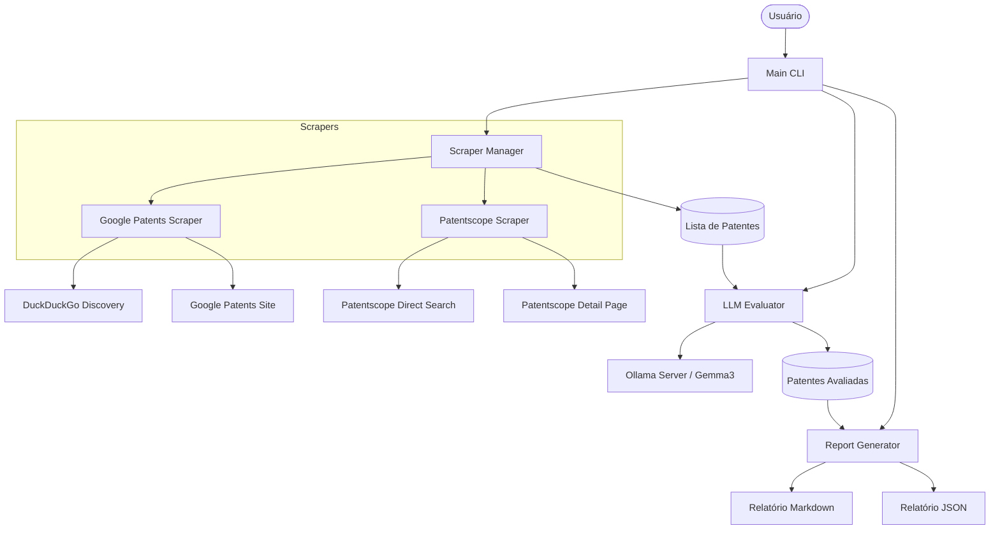

# Arquitetura do Sistema de Revisão Técnica de Patentes

Este documento descreve a arquitetura do sistema, seus componentes principais e o fluxo de dados para a coleta, avaliação e relatório de patentes.

## Visão Geral

O sistema é um agente automatizado que busca patentes em múltiplas fontes, utiliza Inteligência Artificial (LLM) para avaliar a relevância técnica de cada patente frente a uma necessidade específica e gera relatórios consolidados em Markdown e JSON.

## Diagrama de Blocos

## Componentes Principais

### 1. Scrapers (`scraper/`)
Responsáveis por extrair dados brutos de fontes externas.
- **`BaseScraper`**: Define a interface comum (`search` e `get_patent_details`).
- **`GooglePatentsScraper`**: Utiliza DuckDuckGo para descoberta inicial de links e faz o parsing direto das páginas do Google Patents.
- **`PatentscopeScraper`**: Realiza buscas diretas no Patentscope (WIPO) mantendo a persistência de sessão (JSF) para garantir a extração de metadados bibliográficos completos (Inventores, Assignees, Datas).

### 2. Evaluator (`evaluator/`)
Orquestra a análise inteligente das patentes.
- **`LLMEvaluator`**: Envia os dados da patente (Título, Resumo) para um modelo de linguagem via Ollama.
- **Prompt Engineering**: Estruturado para extrair utilidade técnica, relevância e um resumo executivo, retornando dados estruturados.

### 3. Models (`models/`)
Define as estruturas de dados fundamentais (Dataclasses).
- **`Patent`**: Armazena metadados (ID, título, inventores, resumo, url, etc.).
- **`PatentEvaluation`**: Armazena a análise gerada pelo LLM.

### 4. Reporter (`report/`)
Gera os artefatos de saída para o usuário.
- **Markdown**: Relatório amigável para leitura com tabelas e links.
- **JSON**: Dados estruturados para integração com outros sistemas.

## Fluxo de Execução (Pipeline)

1. **Entrada**: O usuário fornece uma query (`-q`) e o número máximo de resultados (`-n`).
2. **Scraping**: O sistema executa todos os scrapers configurados em paralelo/sequencial.
3. **Descoberta**: URLs são identificadas e normalizadas.
4. **Extração**: O sistema visita cada URL para coletar detalhes completos.
5. **Avaliação**: O LLM analisa cada patente individualmente.
6. **Reporte**: Os resultados consolidados são salvos na pasta `output/`.

## Configuração (`config.py`)

Centraliza parâmetros globais:
- **Ollama**: URL do servidor, modelo (ex: `gemma3:4b`) e timeout.
- **Scraper**: User-Agents rotatívos, retries e timeouts de rede.
- **Output**: Diretório padrão para os arquivos gerados.

## Extensibilidade

O sistema foi desenhado para ser facilmente estensível:
- **Novas Fontes**: Basta criar uma nova classe em `scraper/` herdando de `BaseScraper`.
- **Novos Modelos**: Alterar `OLLAMA_MODEL` no `config.py`.
- **Novos Formatos de Saída**: Adicionar lógica ao `report/generator.py`.
