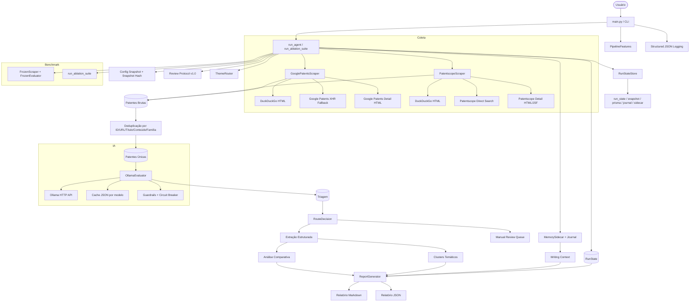

# Arquitetura do Sistema de Revisão Técnica de Patentes

> Estado documentado a partir da árvore de trabalho atual em `2026-04-06`.
> Este documento substitui a versão simplificada anterior e passa a refletir a implementação real já existente no repositório.

## 1. Visão Geral Atual

O projeto deixou de ser apenas um scraper com avaliação por LLM e virou um pipeline técnico de revisão de patentes com:

- coleta multi-fonte via `requests` + `BeautifulSoup`;
- deduplicação por identidade, URL, título, conteúdo e família de patentes;
- triagem em duas fases com Ollama;
- guardrails heurísticos para conter falsos positivos semânticos;
- roteamento explícito por tema, confiança e necessidade de revisão;
- memória operacional append-only com sidecar separado do estado principal;
- persistência incremental de estado e artefatos auxiliares;
- síntese temática por cluster;
- análise comparativa entre patentes incluídas;
- benchmark congelado offline para regressão;
- suíte de ablação com feature flags;
- observabilidade estruturada em JSON lines;
- relatórios finais em Markdown e JSON com metadados ricos.

Em termos arquiteturais, o sistema hoje é um pipeline sequencial, orientado a arquivos, sem banco de dados e sem filas externas. Todo o estado operacional relevante fica em memória durante a execução e é persistido em artefatos JSON/Markdown no filesystem.

## 2. Resumo da Evolução Já Incorporada

A versão atual já incorpora, em relação ao esqueleto inicial, as seguintes expansões:

- criação da camada `pipeline/` com orquestração formal, estado persistido, protocolo, roteamento, memória, benchmark congelado e ablation;
- criação de `analysis_utils.py` para contratos de fallback e validação de conteúdo comparativo;
- criação de `logging_utils.py` para logging estruturado em JSON;
- expansão do `OllamaEvaluator` para cache, telemetria, circuit breaker, prompts em duas fases, guardrails e síntese comparativa pós-processada;
- expansão de `Patent` e `PatentEvaluation` com `record_id`, `family_id`, rotas, score de triagem, evidências, confiança, erro de LLM, problema, solução, vantagens, limitações e maturidade;
- expansão dos scrapers com diagnósticos explícitos de bloqueio/layout e fallback real;
- expansão do gerador de relatórios com protocolo, cobertura, PRISMA-like, clusters, fila manual, telemetria, observabilidade e estado do rascunho;
- criação de testes unitários e testes de pipeline congelado;
- criação de `Makefile`, `README.md`, workflow de CI e benchmarks locais;
- geração de artefatos reais de live evaluation, ablation e relatórios comparativos já presentes em `output/`.

## 3. Estrutura Atual do Repositório

```text
.
├── main.py
├── config.py
├── analysis_utils.py
├── logging_utils.py
├── models/
│   └── patent.py
├── scraper/
│   ├── base.py
│   ├── google_patents.py
│   └── patentscope.py
├── evaluator/
│   └── llm_evaluator.py
├── pipeline/
│   ├── orchestrator.py
│   ├── state.py
│   ├── memory.py
│   ├── router.py
│   ├── protocol.py
│   ├── features.py
│   ├── frozen_benchmark.py
│   └── ablation.py
├── report/
│   └── generator.py
├── benchmarks/
│   ├── ablation_benchmark.json
│   ├── frozen_ablation_benchmark.json
│   └── frozen_pipeline_fixture.json
├── tests/
│   ├── test_architecture.py
│   ├── test_frozen_pipeline.py
│   └── fixtures/
├── .github/workflows/ci.yml
├── Makefile
├── README.md
└── output/
```

Além dos módulos acima, existe `test_gp_json.py`, que funciona como script exploratório para validar o endpoint XHR do Google Patents.

## 4. Diagrama Arquitetural Atualizado



## 5. Camadas e Componentes

### 5.1. Entrada, CLI e composição

`main.py` é o ponto de entrada da aplicação.

Responsabilidades atuais:

- parsear argumentos de execução;
- configurar logging estruturado;
- sobrescrever thresholds em `config.py` a partir da CLI;
- construir um `PipelineFeatures`;
- escolher entre `run_agent(...)` e `run_ablation_suite(...)`.

Parâmetros suportados hoje:

- `--query` / `-q`
- `--max-results` / `-n`
- `--model` / `-m`
- `--output-dir` / `-o`
- `--verbose`
- `--include-threshold`
- `--review-threshold`
- `--disable-evidence`
- `--disable-clusters`
- `--disable-prisma`
- `--disable-snapshot`
- `--disable-comparative-analysis`
- `--disable-manual-review`
- `--ablation`
- `--benchmark-file`

### 5.2. Configuração global (`config.py`)

Parâmetros centrais atualmente codificados:

| Grupo | Parâmetro | Valor atual |
|---|---|---|
| Ollama | `OLLAMA_BASE_URL` | `http://localhost:11434` |
| Ollama | `OLLAMA_MODEL` | `gemma3:4b` |
| Ollama | `OLLAMA_TIMEOUT` | `600s` |
| Ollama | `OLLAMA_MAX_FAILURES_BEFORE_DEGRADE` | `3` |
| Ollama | `OLLAMA_HEALTHCHECK_PROMPT` | `{"status":"ok"}` |
| Triagem | `SCREEN_INCLUDE_THRESHOLD` | `7.0` |
| Triagem | `SCREEN_REVIEW_THRESHOLD` | `4.5` |
| Triagem | `SCREEN_MAX_ITEMS_FOR_REVIEW` | `20` |
| Protocolo | `REVIEW_PROTOCOL_VERSION` | `1.0` |
| Memória | `MEMORY_SLOT_MAX_ITEMS` | `5` |
| Cache | `ENABLE_LLM_CACHE` | `True` |
| Scraper | `MAX_RESULTS` | `10` |
| Scraper | `REQUEST_TIMEOUT` | `30s` |
| Scraper | `RETRY_ATTEMPTS` | `3` |
| Scraper | `RETRY_DELAY` | `2s` |
| Output | `OUTPUT_DIR` | `output` |
| Output | `LLM_CACHE_DIR` | `output/cache` |

Clusters prioritários do roteador:

- `CO2 Cycle Configurations`
- `Cryogenic Energy Systems`
- `Phase Change Materials`
- `Thermal Transfer Mechanisms`
- `Economic Optimization`

### 5.3. Modelos de domínio (`models/patent.py`)

#### `Patent`

Representa a entidade patente já enriquecida pelo scraping e pela deduplicação.

Campos atuais:

- `record_id`: identificador interno estável da execução;
- `family_id`: assinatura de família para fusão conservadora entre publicações equivalentes;
- `title`
- `patent_id`
- `abstract`
- `inventors`
- `assignee`
- `filing_date`
- `publication_date`
- `url`
- `snippet`
- `source`

Métodos:

- `to_dict()`
- `short_description()`

#### `PatentEvaluation`

Representa tanto a triagem quanto a avaliação detalhada.

Campos atuais:

- identidade: `record_id`, `patent_id`
- roteamento: `analysis_route`, `route_reason`
- triagem: `screening_score`, `screening_decision`, `screening_reason`
- evidência e cluster: `evidence_snippets`, `thematic_cluster`
- análise detalhada: `relevance_score`, `summary`, `key_findings`, `potential_applications`, `technical_domain`, `innovation_level`, `problem_statement`, `solution_summary`, `claimed_advantages`, `limitations`, `maturity_level`
- confiança e governança: `confidence`, `manual_review_required`, `llm_error`

Método:

- `to_dict()`

### 5.4. Logging e utilidades de análise

#### `logging_utils.py`

Fornece:

- `StructuredLogFormatter`: serializa logs em JSON lines com `timestamp`, `level`, `logger`, `event` e campos adicionais;
- `configure_structured_logging(...)`: substitui handlers do root logger;
- `log_event(...)`: API única para emissão de eventos estruturados.

#### `analysis_utils.py`

Fornece:

- `COMPARATIVE_ANALYSIS_FALLBACK`
- `COMPARATIVE_ANALYSIS_NO_INPUT`
- `has_substantive_comparative_analysis(text)`: considera uma síntese substantiva apenas quando o texto existe e não é apenas aviso.

Esse contrato é reutilizado por:

- gerador de relatório;
- artefato PRISMA-like;
- fluxo de fallback da análise comparativa.

### 5.5. Camada de scraping (`scraper/`)

#### `BaseScraper`

Define:

- interface abstrata `search(...)`;
- interface abstrata `get_patent_details(...)`;
- coleta de diagnósticos em `self.diagnostics`;
- detecção genérica de bloqueio/CAPTCHA por `BLOCK_PATTERNS`;
- logging estruturado por scraper.

Diagnósticos suportados hoje incluem, entre outros:

- `blocked_or_captcha`
- `blocked_http`
- `discovery_empty`
- `layout_break`
- `fallback_unavailable`
- `search_error`
- `xhr_error`

#### `GooglePatentsScraper`

Estratégia atual:

1. cria uma `requests.Session` com User-Agent fixo por sessão;
2. tenta descoberta via DuckDuckGo HTML com query `site:patents.google.com ...`;
3. se DuckDuckGo falhar, cai no endpoint XHR `https://patents.google.com/xhr/query`;
4. para cada URL resultante, abre a página de detalhe e faz parsing semântico.

Detalhes relevantes:

- remove `Accept-Encoding` antes do request para reduzir problemas ambientais;
- usa backoff exponencial com `RETRY_DELAY * (2 ** attempt)`;
- registra bloqueio para HTTP `403` e `429`;
- extrai `patent_id` da URL por regex;
- parseia `title`, `abstract`, `inventors`, `assignee`, `filing_date` e `publication_date`;
- se o título falhar, usa `<title>` como fallback;
- o fallback XHR devolve JSON estruturado e depois reutiliza `get_patent_details(...)`;
- o scraper não usa Selenium, Playwright ou browser real.

#### `PatentscopeScraper`

Estratégia atual:

1. cria `requests.Session` própria com User-Agent fixo;
2. tenta descoberta via DuckDuckGo HTML em `site:patentscope.wipo.int ...`;
3. se falhar, usa busca direta em `https://patentscope.wipo.int/search/en/result.jsf`;
4. preserva URLs com `jsessionid` e `_cid` quando necessário para manter a sessão JSF;
5. visita a página de detalhe e parseia campos bibliográficos.

Detalhes relevantes:

- parsing de título com múltiplos seletores;
- parsing de abstract com múltiplos seletores;
- leitura de inventores, applicant/assignee e datas por label textual;
- limpeza de ruído JS e marcações como `(EN)`;
- preservação de quebras de linha na captura de inventores antes da normalização;
- delays mais longos entre detalhes do que no Google (`2s` a `4s`).

### 5.6. Avaliação com LLM (`evaluator/llm_evaluator.py`)

#### Papel da classe

`OllamaEvaluator` concentra:

- healthcheck do backend Ollama;
- cache em disco;
- telemetria por operação;
- controle de degradação global;
- triagem rápida;
- avaliação detalhada;
- geração de análise comparativa.

#### Conectividade e healthcheck

Fluxo atual:

1. consulta `GET /api/tags`;
2. valida se o modelo está presente;
3. executa `_probe_model_generation()` usando o prompt fixo `{"status":"ok"}`;
4. só considera o LLM realmente disponível se tags e geração curta funcionarem.

Regra de matching do modelo:

- se o modelo vier com tag, por exemplo `gemma3:4b`, o match é exato;
- sem tag, aceita prefixo de família.

#### Cache

Características:

- cache habilitável por `config.ENABLE_LLM_CACHE`;
- chave SHA-256 baseada em modelo, base URL, prompt, formato, `num_predict`, `temperature` e `top_p`;
- arquivo de cache por modelo em `cache_dir/<safe_model_name>.json`;
- contadores de `hits`, `misses` e `entries`;
- persistência imediata após cada resposta válida.

#### Telemetria e circuit breaker

Métricas mantidas por operação:

- `calls`
- `successes`
- `failures`
- `retries`
- `cache_hits`
- `degraded_skips`
- `prompt_chars`
- `response_chars`
- `total_duration_seconds`
- `max_duration_seconds`
- `average_duration_seconds`

Controle de falhas:

- falhas totais e consecutivas são acumuladas;
- após `3` falhas totais, `self.degraded = True`;
- nesse estado, chamadas seguintes retornam vazio e são contabilizadas como `degraded_skip`;
- o orquestrador converte isso em revisão manual, nunca em exclusão silenciosa.

#### Triagem (`screen_patent`)

Saída esperada do modelo:

- `screening_score`
- `decision`
- `screening_reason`
- `technical_domain`
- `thematic_cluster`
- `evidence_snippets`
- `confidence`

Comportamentos relevantes:

- exige evidência textual quando a feature está ativa;
- se o modelo falhar, retorna uma `PatentEvaluation` de fallback com decisão `review`;
- se a resposta vier vazia, inválida ou com decisão fora do contrato, o item também vira `review`.

#### Guardrails de triagem

O evaluator hoje aplica correções heurísticas além do LLM:

- `_query_tokens(...)`: extrai termos distintivos da query;
- `_query_alignment(...)`: mede cobertura ponderada da query no título/resumo/snippet;
- `_focus_profile(...)`: infere se a patente realmente trata do foco técnico central, com sinais como `carbon_storage_phrase`, `supercritical_focus`, `capture_focus`, `cooling_focus`, `underground_focus` e outros;
- `_apply_screening_guardrails(...)`: recalibra score, rebaixa `include` para `review` ou `exclude` quando o alinhamento é genérico ou parcial.

Esses guardrails existem justamente para evitar que patentes apenas adjacentes ao domínio recebam notas altas por compartilharem termos amplos como `energy`, `thermal`, `storage` ou `system`.

#### Avaliação detalhada (`evaluate_patent`)

Executada para:

- itens `include`;
- itens `review` que entram na fila de extração detalhada limitada.

Campos extraídos do modelo:

- `relevance_score`
- `summary`
- `problem_statement`
- `solution_summary`
- `key_findings`
- `claimed_advantages`
- `limitations`
- `potential_applications`
- `technical_domain`
- `thematic_cluster`
- `innovation_level`
- `maturity_level`
- `evidence_snippets`
- `confidence`

Depois da resposta, `_apply_relevance_guardrails(...)` reescala a nota considerando:

- score da triagem;
- aderência textual à query;
- força do foco técnico;
- presença de termos de armazenamento explícito;
- indícios de uso apenas adjacente do CO2 como fluido de trabalho;
- ausência de abstract/snippet.

#### Análise comparativa

`generate_comparative_analysis(...)`:

- só considera itens `include` sem erro de LLM;
- monta um fact sheet resumido por patente;
- chama o Ollama em modo texto livre;
- remove seções duplicadas de `Panorama Geral` e `Ranking Final` vindas do modelo;
- injeta um `Panorama Geral` determinístico;
- injeta um `Ranking Final` determinístico e ordenado por score;
- injeta seções faltantes de recomendações quando necessário;
- acrescenta um apêndice com mapa de evidências por ID e ranking por ID.

O objetivo dessa pós-edição é impedir:

- afirmações generalizadas para todo o conjunto quando só um subconjunto sustenta a tese;
- rankings instáveis ou duplicados;
- síntese sem rastreabilidade por IDs.

### 5.7. Camada de pipeline (`pipeline/`)

#### `PipelineFeatures`

É o contrato central de composição do pipeline. Flags atuais:

- `require_evidence`
- `enable_thematic_clusters`
- `enable_prisma`
- `enable_snapshot`
- `enable_comparative_analysis`
- `enable_manual_review_queue`

#### `build_review_protocol(...)`

Gera o protocolo metodológico versionado da execução com:

- `version`
- `query`
- `sources`
- `stages`
- `criteria.include`
- `criteria.exclude`
- `thresholds`
- `limits`
- `model`

#### `RunState`

É o snapshot completo de uma execução.

Campos de destaque:

- identidade da execução: `run_id`, `started_at`, `finished_at`, `status`
- contexto de entrada: `query`, `max_results`, `model`, `output_dir`
- composição: `feature_flags`, `config_snapshot`, `snapshot_hash`, `protocol`
- resultados: `patents`, `evaluations`, `comparative_analysis`
- métricas: `coverage_metrics`, `stage_metrics`, `scraper_durations`, `evaluation_duration_seconds`, `comparative_analysis_duration_seconds`, `total_duration_seconds`
- observabilidade: `scraper_diagnostics`, `llm_cache_stats`, `llm_telemetry`, `observability_metrics`
- memória e escrita: `writing_context`, `memory_sidecar`, `memory_journal`
- governança: `manual_review_queue`, `prisma_flow`, `thematic_clusters`
- saída: `output_paths`
- falhas: `errors`

#### `RunStateStore`

Persiste:

- `run_state_<run_id>.json`
- `run_state_latest.json`
- artefatos auxiliares via `save_artifact(...)`

#### `MemorySidecar` e `MemoryJournalEntry`

O sidecar é uma memória operacional separada do `RunState`.

Características:

- journal append-only com `timestamp`, `stage`, `event`, `detail`, `payload`;
- slots de memória com limite por slot;
- `set_slot(..., overwrite=False)` para reter apenas janelas recentes;
- `build_writer_context(...)` já disponível como API, embora o orquestrador atual monte o `writing_context` por helper próprio.

#### `ThemeRouter`

Rotas suportadas:

- `screen_only`
- `manual_review`
- `deep_extraction`
- `thematic_synthesis`

Critérios atuais de roteamento:

- `exclude` vai para `screen_only`;
- erro de LLM vai para `manual_review`;
- decisão `review` vai para `manual_review`;
- confiança `< 0.55` vai para `manual_review`;
- presença de cluster prioritário vai para `thematic_synthesis`;
- presença de evidência textual vai para `deep_extraction`;
- ausência de evidência suficiente cai em `manual_review`.

#### Dedupe e identidade

O orquestrador hoje usa uma deduplicação em duas camadas.

1. Identidade primária por `_identity_key(...)`, na ordem:
   - `patent_id`
   - URL normalizada
   - título normalizado
   - hash de conteúdo (`abstract`, `snippet`, `assignee`, datas)
   - fallback por `source + inventors + url`
2. Dedupe de família por `_family_key(...)`, usando combinação conservadora de:
   - título
   - assignee
   - inventor principal
   - ano

Consequências:

- cada patente recebe `record_id` estável com prefixo `rec_`;
- patentes agrupadas por família passam a compartilhar `family_id`;
- campos são mesclados por `_merge_patents(...)`, nunca descartando a versão mais rica.

#### Fila de revisão manual

`_build_manual_review_queue(...)` gera um contrato explícito com:

- `record_id`
- `patent_id`
- `family_id`
- `title`
- `reason`
- `route`
- `screening_score`
- `screening_decision`
- `llm_error`

Ordenação atual:

1. itens com erro de LLM primeiro;
2. maior score de triagem depois;
3. título em ordem alfabética como desempate.

Há corte por `SCREEN_MAX_ITEMS_FOR_REVIEW`, e o excedente é contabilizado em `manual_review_deferred`.

#### Clusters temáticos

`_build_thematic_clusters(...)` só considera patentes `include` sem erro de LLM.

Labels suportadas por heurística:

- `CO2 Cycle Configurations`
- `CO2 Phase Properties`
- `Cryogenic Energy Systems`
- `Phase Change Materials`
- `Thermal Transfer Mechanisms`
- `Economic Optimization`
- `Solid CO2 Storage`
- fallback para `technical_domain`
- fallback final para `General / Other`

Para cada cluster o estado registra:

- `count`
- `patent_ids`
- `titles`
- `record_ids`
- `average_score`
- `average_confidence`
- `evidence_count`
- `top_patents`
- `summary`

#### PRISMA-like

`_prisma_stage_artifact(...)` produz um fluxo com blocos:

- `identification`
- `screening`
- `eligibility`
- `coverage`
- `synthesis`

O campo `comparative_analysis_generated` depende de `has_substantive_comparative_analysis(...)`, ou seja, não basta existir texto: ele precisa ser substantivo.

#### Writing context e observabilidade

Helpers relevantes:

- `_build_top_patents(...)`
- `_build_route_summary(...)`
- `_build_writing_context(...)`
- `_build_observability_metrics(...)`
- `_record_stage_metric(...)`

O `writing_context` atual contém:

- `protocol`
- `coverage_metrics`
- `top_patents`
- `thematic_clusters`
- `route_summary`
- `feature_flags`
- `snapshot_hash`

As métricas de observabilidade agrupam:

- rotas;
- fontes;
- falhas.

### 5.8. Orquestração detalhada (`run_agent`)

Fluxo real atual:

1. cria `PipelineFeatures`, snapshot e `RunState`;
2. instancia `RunStateStore`, `MemorySidecar` e `ThemeRouter`;
3. verifica disponibilidade do LLM;
4. executa scrapers sequencialmente;
5. deduplica incrementalmente após cada fonte;
6. persiste estado parcial após cada scraper;
7. executa triagem;
8. roteia cada patente;
9. executa extração detalhada apenas para incluídas e itens de revisão dentro do limite;
10. monta fila manual;
11. monta clusters;
12. gera PRISMA-like;
13. salva cache/telemetria/estado parcial;
14. gera análise comparativa, se elegível;
15. monta `writing_context`;
16. gera relatórios;
17. salva artefatos finais adicionais;
18. reescreve os relatórios com o `run_metadata` final já completo;
19. salva `run_state` final e emite sumário.

Detalhes importantes:

- scrapers são executados de forma sequencial, não paralela;
- o sistema salva `run_state` mesmo em cenários degradados;
- se não houver patentes, encerra com `status = "no_results"` e não gera relatório final;
- se o LLM estiver indisponível, todas as patentes viram `review` e a fila manual passa a ser a saída principal;
- se o circuit breaker abrir no meio da execução, a pipeline continua em modo degradado;
- o relatório final é escrito duas vezes para incorporar `output_paths`, `snapshot`, `prisma`, `memory_journal` e `memory_sidecar` já persistidos.

### 5.9. Relatórios (`report/generator.py`)

`ReportGenerator` é responsável por:

- definir nomes versionados de arquivos;
- gerar Markdown;
- gerar JSON;
- reescrever arquivos em caminhos fixos quando necessário;
- calcular `draft_status`.

#### Relatório Markdown

Seções atualmente suportadas:

- protocolo metodológico;
- cobertura e seleção;
- fluxo PRISMA-like;
- síntese temática;
- contexto compartilhado;
- métricas por etapa;
- diagnósticos de coleta;
- telemetria do LLM;
- observabilidade estruturada;
- resumo executivo;
- análise detalhada das patentes;
- fila de revisão manual;
- análise comparativa;
- informações do sistema.

#### Relatório JSON

Estrutura atual:

- `metadata`
- `results`
- `comparative_analysis`

Dentro de `metadata`, o sistema inclui:

- `query`
- `timestamp`
- `total_patents`
- `model`
- `average_relevance`
- `run_state`
- `feature_flags`
- `writing_context`
- `stage_metrics`
- `llm_cache_stats`
- `llm_telemetry`
- `observability_metrics`
- `scraper_diagnostics`
- `prisma_flow`
- `thematic_clusters`
- `config_snapshot`
- `snapshot_hash`
- `draft_status`

#### Draft gate

`_draft_status(...)` não bloqueia a escrita do arquivo, mas marca a prontidão do rascunho.

Status possíveis:

- `ready`
- `blocked`

Critérios:

- sem patentes, o rascunho recebe aviso;
- sem avaliações substantivas e sem análise comparativa substantiva, o rascunho recebe aviso;
- relatórios de fallback puro ficam como `blocked`.

### 5.10. Benchmark congelado (`pipeline/frozen_benchmark.py`)

Existe hoje um modo offline determinístico.

Componentes:

- `FrozenScraper`
- `FrozenEvaluator`
- `build_frozen_components(...)`

Objetivo:

- permitir regressão estável sem depender de rede nem de Ollama.

Fixture atual:

- `benchmarks/frozen_pipeline_fixture.json`

Esse fixture já embute:

- duas fontes (`Google Patents` e `Patentscope`);
- duas patentes;
- avaliações congeladas completas;
- análise comparativa congelada.

### 5.11. Suíte de ablação (`pipeline/ablation.py`)

O projeto hoje possui um harness explícito de comparação entre variantes do pipeline.

Variantes padrão:

- `baseline`
- `no_evidence`
- `no_clusters`
- `no_prisma`
- `no_snapshot`
- `no_comparative_analysis`
- `no_manual_review`

Benchmarks já declarados:

- `benchmarks/ablation_benchmark.json`: `CO2 thermal storage`, `Phase change materials` e `Transcritical CO2 cycle`;
- `benchmarks/frozen_ablation_benchmark.json`: caso offline `Frozen CO2 thermal storage`.

Saídas da suíte:

- `ablation_summary.json`
- `ablation_summary.md`

Métricas agregadas:

- relevância média;
- tempo total médio;
- tempo médio de avaliação;
- média de incluídas;
- média de itens em revisão manual;
- média de clusters;
- média de extrações completas;
- deltas contra baseline;
- identificação do melhor por qualidade e do mais rápido.

### 5.12. Testes, automação e operação

#### Testes

O repositório já possui:

- `tests/test_architecture.py`
- `tests/test_frozen_pipeline.py`

Contratos atualmente cobertos:

- logging estruturado;
- serialização de `PipelineFeatures`;
- retenção e journal da `MemorySidecar`;
- roteamento do `ThemeRouter`;
- serialização do `RunState`;
- `draft_status` do relatório;
- carga de cache do LLM;
- validação exata de modelo no Ollama;
- fallback de falha do LLM para `review`;
- guardrails de triagem para sobreposição genérica;
- degradação global após falhas repetidas;
- retry de chamadas textuais do LLM;
- separação de escala de relevância por guardrails;
- pós-processamento da análise comparativa;
- geração do artefato PRISMA-like;
- dedupe por conteúdo e por família;
- mapeamento de avaliações por `record_id`;
- renderização da fila manual no relatório;
- parsers de detalhe via fixtures HTML;
- detecção de bloqueio;
- presença de métricas/telemetria/observabilidade nos relatórios;
- execução completa do pipeline congelado;
- execução da suíte de ablação congelada.

#### CI

Existe workflow em `.github/workflows/ci.yml` que:

- usa Ubuntu;
- instala Python `3.12`;
- instala dependências via `requirements.txt`;
- executa `python -m unittest tests.test_architecture tests.test_frozen_pipeline`.

#### Makefile

Alvos atuais:

- `test`
- `test-frozen`
- `benchmark-frozen`
- `smoke-ollama`
- `run`
- `ci`

#### Ambiente operacional

O projeto já documenta e declara:

- uso preferencial de `venv/bin/python` no `README.md`;
- dependências em `requirements.txt`: `requests`, `beautifulsoup4`, `lxml`, `tqdm` e `rich`.

## 6. Fluxo de Dados Fim a Fim

### 6.1. Setup

- CLI recebe query, limites e flags.
- Logging estruturado é configurado.
- Snapshot de configuração e protocolo são montados.
- `RunState` é iniciado com `status = "running"`.

### 6.2. Identificação

- cada scraper busca até `max_results`;
- cada lote retorna `Patent`;
- o orquestrador acumula tudo em memória;
- a deduplicação roda incrementalmente após cada fonte;
- diagnósticos e duração por fonte são persistidos no estado.

### 6.3. Triagem

- cada patente passa por `screen_patent(...)`;
- o evaluator devolve score, decisão, domínio, cluster, evidência e confiança;
- guardrails recalibram a decisão;
- o router define a rota analítica e o slot de memória.

### 6.4. Extração detalhada

- incluídas seguem sempre para extração;
- itens `review` só recebem extração detalhada se estiverem dentro do limite de revisão;
- itens fora do limite continuam aparecendo na fila manual;
- erros do LLM voltam para `review`.

### 6.5. Síntese

- clusters temáticos são montados para incluídas;
- PRISMA-like é calculado;
- análise comparativa roda apenas se houver LLM disponível, pipeline não degradado e pelo menos duas patentes incluídas elegíveis.

### 6.6. Escrita

- `writing_context` consolida protocolo, cobertura, top patentes, clusters, rotas e snapshot;
- `ReportGenerator` escreve Markdown e JSON;
- artefatos auxiliares são persistidos;
- o estado final é salvo com os caminhos absolutos de saída.

## 7. Artefatos Persistidos

Padrões de saída já implementados:

- `run_state_<run_id>.json`
- `run_state_latest.json`
- `config_snapshot_<run_id>.json`
- `prisma_flow_<run_id>.json`
- `memory_journal_<run_id>.json`
- `memory_sidecar_<run_id>.json`
- `patentes_<query>_<timestamp>.md`
- `patentes_<query>_<timestamp>.json`
- `<safe_model_name>.json` para cache do LLM

Observação importante: o cache do evaluator usa o `output_dir` da execução como pasta de cache quando o pipeline é acionado pelo orquestrador.

## 8. Falhas, Degradação e Resiliência

O sistema hoje lida explicitamente com:

- indisponibilidade total do Ollama;
- modelo ausente no servidor;
- timeout e erros HTTP do LLM;
- circuit breaker após falhas repetidas;
- scrapers bloqueados por CAPTCHA ou rate limit;
- layout break nos parsers;
- ausência de abstract/snippet;
- patentes sem ID;
- duplicatas entre fontes e entre publicações da mesma família;
- ausência de patentes suficientes para análise comparativa;
- relatórios sem conteúdo substantivo.

Princípio operacional atual:

- falha de infraestrutura tende a virar `review`, não `exclude`.

## 9. Estado Atual Materializado no Repositório

Além do código, já existem artefatos concretos que comprovam a evolução da arquitetura:

- execuções live em `output/live_eval/` com timestamp de `2026-04-04`;
- execuções adicionais em `output/live_eval_round2/`, `output/live_eval_round3/` e `output/live_eval_round4/`, todas em `2026-04-05`;
- nova rodada em `output/live_eval_20260406/`, com snapshot e relatórios gerados em `2026-04-06`;
- suíte de ablação em `output/ablation_20260404_234648/`;
- relatórios comparativos e consolidados como:
  - `output/relatorio_consolidado_20260405.md`
  - `output/relatorio_melhorias_tecnicas.md`
  - `output/comparacao_melhorias_tecnicas.md`
  - `output/comparacao_modelos_atual_vs_antigo.md`
  - `output/relatorio_whitespace_20260406.md`
  - `output/relatorio_whitespaces_patent_landscape_20260406.md`
- relatórios mais antigos de execuções do domínio em `2026-02-21`, mantendo histórico de uso do pipeline.

## 10. Conclusão Arquitetural

O sistema atual pode ser descrito como um pipeline de revisão técnica de patentes, orientado a arquivos, com scraping multi-fonte, triagem em duas fases por LLM, guardrails heurísticos, deduplicação forte, memória operacional, observabilidade estruturada, benchmark offline congelado e suíte de ablação.

Em outras palavras, a arquitetura já evoluiu de um fluxo linear simples para uma plataforma local de experimentação e produção assistida para revisão técnica de patentes, com contratos explícitos, artefatos reproduzíveis e mecanismos reais de fallback.
